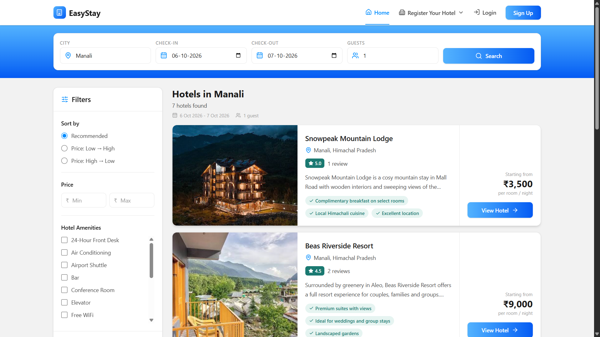
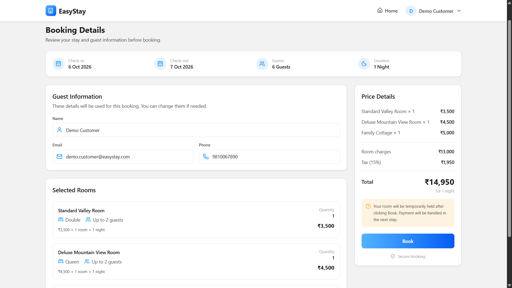
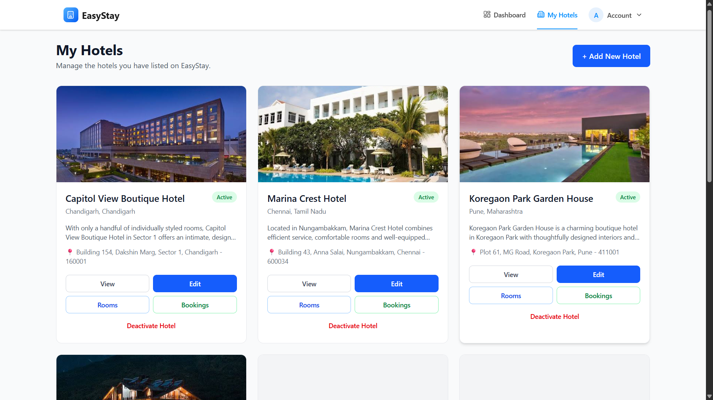

# EasyStay: Hotel Booking Platform

A full-stack hotel booking platform inspired by MakeMyTrip, built with the MERN stack. Customers search and book hotels; owners list and manage properties. The core of the project is a **concurrency-safe booking engine** that prevents double-booking.

**Live demo:** <[ADD LINK](https://easy-stay-dun.vercel.app)>
**Demo logins:** Customer: `<demo.customer@easystay.com> / <123456>` | Owner: `<demo.owner@easystay.com> / <123456>`





---

## Tech Stack

| Layer | Technology |
|---|---|
| Frontend | React.js, Tailwind CSS, lucide-react |
| Backend | Node.js, Express.js |
| Database | MongoDB + Mongoose |
| Auth | JWT, role-based (customer, owner) |
| File uploads | Cloudinary |
| Scheduling | node-cron |

**Backend architecture:** `Routes → Controllers → Services → Models`

---

## Features

### Customer
- Signup/login, and a profile page
- Search hotels by city (exact, case-insensitive match), dates and guests
- Filter by price range and amenities; sort results
- Select multiple room types and quantities in a single booking
- Login redirect that returns you to your in-progress selection
- Checkout with a 15-minute hold and countdown timer
- Mock payment flow and booking confirmation
- Cancel confirmed upcoming bookings, with the refund recorded on the payment
- My Bookings: full history including expired and cancelled bookings
- Review a hotel after a completed stay (one review per booking)

### Owner
- Add, view, edit and deactivate hotels (hotels are deactivated, never deleted)
- Manage rooms per hotel: bed type, capacity, price, inventory, amenities, images
- Dashboard with counts for hotels, rooms and bookings
- Bookings drill-down: hotels → bookings filtered by status → full booking detail (read-only)
- View reviews for their own hotels (read-only)
- Image uploads through Cloudinary

---

## Key Engineering Decisions

### 1. Preventing double-booking (concurrency)
Booking creation runs inside a MongoDB transaction (`session.withTransaction`):

1. Validate the input: dates (YYYY-MM-DD), checkOut > checkIn, no past check-in, max 60 nights, valid items.
2. **Lock each selected room** by incrementing a `bookingLockVersion` field inside the transaction. If two requests touch the same room at the same time, MongoDB raises a write conflict, aborts one transaction, and `withTransaction` retries it.
3. **Re-check availability inside the same transaction, after the lock**. This closes the check-then-act race.
4. Verify all rooms belong to one active hotel and that total capacity >= guest count.
5. Build the booking from server-computed prices (client-sent prices are never trusted) and create it with `status: held`, `holdExpiresAt = now + 15 min`.

### 2. Availability rule
Two date ranges overlap when `checkIn < existingCheckOut && checkOut > existingCheckIn`.
Bookings that count toward occupancy:
- `confirmed` bookings
- `held` bookings where `holdExpiresAt > now`

Expired holds, cancelled bookings and failed bookings never block availability.

### 3. Payment confirmation without races
Confirmation is a single conditional atomic update:

```js
Booking.updateOne(
  { _id, userId, status: "held", holdExpiresAt: { $gt: now } },
  { status: "confirmed" }
)
```

If `modifiedCount !== 1`, the payment is rejected. This closes the race between payment and hold expiry. Duplicate payments are blocked by checking for an existing successful payment first.

### 4. Hold expiry
A node-cron job runs every minute and sets `held → expired` where `holdExpiresAt <= now`. Expired bookings are kept as history and are never deleted.

### 5. Booking status model
Statuses are `held`, `confirmed`, `expired`, `cancelled` and `failed`. There is no `completed` status. A finished stay is derived as a `confirmed` booking where `checkOut < now`, so there is no extra state to keep in sync.

### 6. Booking snapshots
Each booking stores a snapshot of guest info (captured at checkout) and of every room item (name, capacity, price per room, quantity, subtotal). Later edits to a room or hotel never change past bookings.

### 7. Reviews without denormalized ratings
Reviews are the only source of truth. Average rating and review count are computed with an aggregation when needed, so they cannot drift out of sync. A unique index on `bookingId` enforces one review per stay. A booking is eligible when `status === "confirmed"` and `checkOut <= now`.

### 8. Cancellation
Cancellation is handled through a transaction.

The booking moves from `confirmed` to `cancelled`, and the linked payment is updated to record the refund state.

Because cancelled bookings are excluded from the availability query, the cancelled rooms automatically become available for future bookings.

### 9. Search state in the URL
City, dates, guests, filters, sort and page live in the URL query string. This gives shareable links, a working back button, and persistence on refresh.

### 10. Tax calculation
`baseAmount + taxAmount = totalAmount`, calculated server-side with a flat GST rate.

---

## Data Models (summary)

- **User:** name, email, password hash, role, phone
- **Hotel:** ownerId, name, description, address, location, amenities, highlights, images, status
- **Room:** hotelId, name, bedType, capacity, price, totalRooms, amenities, images, status, bookingLockVersion
- **Amenity:** name, type (hotel/room), active
- **Booking:** hotelId, userId, guestInfo, checkIn, checkOut, guestCount, items[], status, holdExpiresAt, baseAmount, taxAmount, totalAmount
- **Payment:** bookingId, userId, amount, currency, provider, status, method, refundedAmount, failureReason
- **Review:** hotelId, userId, bookingId (unique), rating (1-5), text

---

## API Overview

| Area | Endpoints |
|---|---|
| Auth | signup, login |
| Hotels | search, details, owner CRUD (deactivate, no delete) |
| Rooms | owner CRUD per hotel |
| Bookings | `POST /bookings`, `GET /bookings/my`, `POST /bookings/:id/cancel`, owner views |
| Payments | `POST /payments` |
| Reviews | `POST /reviews`, `GET /reviews/hotel/:hotelId`, `GET /reviews/my`, `PUT/DELETE /reviews/:id`, `GET /reviews/owner/hotel/:hotelId` |

---

## Project Structure

```
backend/
  src/
    routes/
    controllers/
    services/
    models/
    middleware/
    jobs/          # node-cron hold-expiry job
frontend/
  src/
    pages/
    components/
```

---

## Getting Started

### Prerequisites
- Node.js 18+
- MongoDB running as a **replica set** (required for transactions; MongoDB Atlas works out of the box)
- Cloudinary account

### Backend
```bash
cd backend
npm install
cp .env.example .env   # fill in values
npm run dev
```

`.env` (adjust names to match your code):
```
PORT=5000
MONGO_URI=
JWT_SECRET=
CLOUDINARY_CLOUD_NAME=
CLOUDINARY_API_KEY=
CLOUDINARY_API_SECRET=
```

### Frontend
```bash
cd frontend
npm install
npm run dev
```

---

## Scope: Planned but Not Built

These were scoped out deliberately for a portfolio project (effort vs. value), and are not oversights:

- **Admin role and panel** (hotel approval, user blocking, moderation, revenue dashboards). The role exists in the schema but is not implemented.
- **Real payment gateway.** Payment is a mock provider that simulates the flow.
- **Email OTP and Google login**
- **PDF receipts and email delivery**
- **Owner actions on bookings** (cancel/edit/refund). Owner booking views are read-only.
- **Owner review responses and moderation**
- **Revenue and tax dashboards.** The owner dashboard shows counts only.
- **Partial-match and autocomplete city search.** Search is an exact, case-insensitive city match for now.
- **Per-room guest distribution.** One guest count per booking, validated against total capacity.
- **Tiered refund policies**

---

## Author

**Prashant Patole** · [LinkedIn](https://www.linkedin.com/in/prashant-patole-b6469b334/) · [GitHub](https://github.com/prashantpatole2223/)